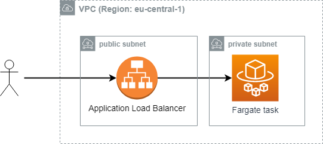
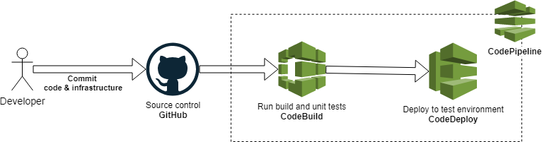

# Blazor Sample Application

# What this sample has:

* [Blazor](https://docs.microsoft.com/en-us/aspnet/core/blazor/?view=aspnetcore-3.1) is a framework for building interactive client-side web UI with .NET
* [Radzen Blazor Components](https://blazor.radzen.com/) is a free set of 50+ native Blazor UI controls.
* [bUnit](https://github.com/egil/bUnit) is a testing library for Blazor Components
* [Docker](https://www.docker.com/) is a set of platform as a service (PaaS) products that use OS-level virtualization to deliver software in packages called containers.
* [AWS copilot](https://github.com/aws/copilot-cli/wiki) is a tool for developers to create, release and manage production ready containerized applications on Amazon ECS and AWS Fargate.

## Architecture



## CI/CD



## Local development

### Prerequisites
* Install [Docker desktop](https://www.docker.com/products/docker-desktop)
* Install [Visual Studio 2019](https://visualstudio.microsoft.com/downloads/)
* Clone repository
```cmd
git clone https://github.com/efimenkop/BlazorDemo
```
### Running locally
Open `BlazorDemo.sln` in Visual Studio and hit `F5`

*OR*
```cmd
dotnet run --project BlazorDemo\BlazorDemo.csproj
```

### Running tests
In Visual Studio **Test** -> **Run All Tests**

*OR*
```cmd
dotnet test
```

## Deploying to [AWS Fargate](https://aws.amazon.com/fargate/) with [copilot](https://aws.amazon.com/blogs/containers/introducing-aws-copilot/)

The AWS Copilot CLI is a tool for developers to create, release and manage production ready containerized applications on Amazon ECS and AWS Fargate. From getting started, pushing to a test environment and releasing to production, Copilot helps you through the entire life of your app development.

### Prerequisites
* [Create AWS account](https://aws.amazon.com/resources/create-account/)
* [Install](https://aws.amazon.com/cli/) and [configure](https://docs.aws.amazon.com/cli/latest/userguide/cli-chap-configure.html)  AWS CLI
* Install [AWS copilot](https://github.com/aws/copilot-cli/wiki#installing)\*

\* *if you're on **Windows**: download [`copilot-windows-v0.3.0.exe`](https://github.com/aws/copilot-cli/releases/download/v0.3.0/copilot-windows-v0.3.0.exe) and move it to solution folder*

* Deploy application 

**Windows**

```cmd
.\copilot-windows-v0.3.0.exe init --app blazorapp ^
--svc blazor-demo ^
--svc-type "Load Balanced Web Service" ^
--dockerfile "Dockerfile" ^
--deploy
```

**Linux**

```sh
copilot init --app blazorapp \
--svc blazor-demo \
--svc-type 'Load Balanced Web Service' \
--dockerfile 'Dockerfile' \
--deploy
```